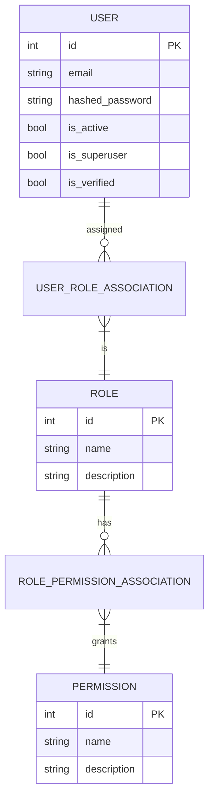

# Scalable FastAPI RBAC Template

This project is a feature-rich FastAPI template designed for building robust and scalable web applications. It comes pre-configured with a dynamic, database-driven Role-Based Access Control (RBAC) system, asynchronous database support with `SQLAlchemy`, `Alembic` for migrations, and a clean, modular project structure.

## Key Features

- **Dynamic RBAC**: Manage roles and permissions at runtime via API. No code changes or redeployments needed to update access control policies.
- **Asynchronous Support**: Built with `async`/`await` from the ground up, using `SQLAlchemy`'s async capabilities for non-blocking database operations.
- **Dependency Injection**: Leverages FastAPI's dependency injection system for clean, testable code.
- **Database Migrations**: Integrated with `Alembic` to manage database schema changes smoothly.
- **Admin Interface**: Comes with a basic `SQLAdmin` interface to view and manage data.
- **Structured Logging**: Pre-configured with `loguru` for both human-readable console logs and structured JSON logs for production.
- **Clear Project Structure**: Organized into logical modules (`api`, `crud`, `models`, `schemas`) for maintainability.

## Dynamic RBAC System

The core of this template is its powerful and flexible RBAC system. Unlike hardcoded permission checks, this system stores users, roles, and permissions in the database, allowing for dynamic management.

### Entity Relationship Diagram

The diagram below illustrates the relationships between the core security models: `User`, `Role`, and `Permission`.



### How It Works

1.  **Permissions**: A permission is a string (e.g., `"users:read"`) that represents a specific action. The system uses a dual-pronged approach:
    -   **In Code**: Developers use constants from `app/core/permissions.py` to protect specific API endpoints. This hardcodes the *requirement* for a permission.
    -   **In Database**: Administrators create corresponding permission records in the database via the API. This is what can be assigned to roles to dynamically *grant* the permission.
    For a check to pass, the permission string required by the code must exist in the database and be assigned to a role the user has.
2.  **Roles**: A role is a collection of permissions. Instead of assigning individual permissions to users, you assign a set of permissions to a role (e.g., a "Manager" role might have `"users:read"` and `"users:update"` permissions). This is managed in the `roles` table.
3.  **Users**: A user can be assigned one or more roles. A user's total set of permissions is the sum of all permissions granted by their assigned roles.
3.  **Enforcement via Dependencies**: API endpoints are protected using special dependencies that check a user's permissions:
    -   `RequiresPermission("permission:name")`: The most straightforward dependency. It checks if the user has the exact permission string provided. The best practice is to use constants from `app.core.permissions` to avoid typos (e.g., `RequiresPermission(perms.USERS_READ)`).
    -   `AutoPermission()`: A more advanced, convention-based dependency. It automatically determines the required permission from the request's URL and method (e.g., a `GET` request to `/api/v1/profiles/` would require `"profiles:read"`). This is powerful for rapid development but can also be explicitly overridden if needed (e.g., `AutoPermission(override=perms.USERS_READ)`).
4.  **Access Control**: If a user lacks the required permission, the dependency raises an HTTP 403 Forbidden error, denying access to the endpoint.

### Advantages of This Approach

-   **Runtime Flexibility**: Administrators can create new roles, grant or revoke permissions, and change user access levels through the API at any time, without needing developer intervention or a new deployment.
-   **Centralized Logic**: Permission logic is centralized in the database and the dependency checkers, keeping the business logic in the API endpoints clean and focused.
-   **Scalability**: As the application grows, you can easily add new permissions for new features. The system scales effortlessly without becoming complex.
-   **Maintainability**: By using constants for permission strings (e.g., `app.core.permissions.USERS_READ`), the code remains clean, readable, and less prone to typos.

## How to Extend the System

Expanding the RBAC system is a two-part process involving both a developer to define the permission requirement in the code, and an administrator to create and assign that permission in the database via the API.

### 1. Define a New Permission "Contract" in Code

Add a new permission constant in `app/core/permissions.py`. This provides a single, typo-free source of truth for developers to use when protecting endpoints.

```python
# app/core/permissions.py

# ... existing permissions
PRODUCTS_MANAGE = "products:manage"
PRODUCTS_MANAGE_DESCRIPTION = "Allows creating, editing, and deleting products."
```

### 2. Protect a New Endpoint

Use one of the permission dependencies in your API router. The choice depends on your needs.

**Option A: Explicit Permission (Recommended for clarity)**

Use `RequiresPermission` with a constant. This is clear and unambiguous.

```python
# app/api/routers/products.py
from fastapi import APIRouter, Depends
from app.api.deps import RequiresPermission
from app.core import permissions as perms

router = APIRouter()

@router.post("/", dependencies=[Depends(RequiresPermission(perms.PRODUCTS_MANAGE))])
async def create_product():
    # Your logic to create a product
    return {"message": "Product created successfully"}
```

**Option B: Convention-Based Permission**

Use `AutoPermission` and let it infer the permission name. For a `POST` to `/api/v1/products`, it will require `"products:create"`. You would still need to define this permission in the database for it to work.

```python
# app/api/routers/products.py
from fastapi import APIRouter, Depends
from app.api.deps import AutoPermission

router = APIRouter(prefix="/products", tags=["Products"]) # Assuming prefix is set in main.py

@router.post("/", dependencies=[Depends(AutoPermission())])
async def create_product():
    # Your logic to create a product
    return {"message": "Product created successfully"}
```

### 3. Create and Assign the Permission via API

Once the code is deployed, an administrator can use the RBAC API endpoints to make the permission "live":
1.  **POST** to `/api/v1/rbac/permissions` to create the new `"products:manage"` permission in the database.
2.  **POST** to `/api/v1/rbac/roles/{role_id}/permissions/{permission_id}` to assign this new permission to an existing role (e.g., "Admin").

Now, only users with that role can access the new `create_product` endpoint.

## Potential Improvements

This template provides a solid foundation, but it can be extended further for more complex scenarios:

-   **Dedicated Admin UI**: While `SQLAdmin` is useful, a dedicated, user-friendly frontend for managing roles, permissions, and user assignments would greatly improve usability for non-developers.
-   **Permission Caching**: For applications with high traffic, user permissions can be cached (e.g., in Redis) to reduce the number of database queries required to authorize each API request.
-   **Audit Trails**: Implement logging for all RBAC-related events (e.g., role created, permission granted, user assigned to role) to provide a clear audit trail for security and compliance.
-   **Role Hierarchy**: Introduce a parent-child relationship between roles, allowing for permission inheritance (e.g., an "Admin" role inherits all permissions from a "Moderator" role).
